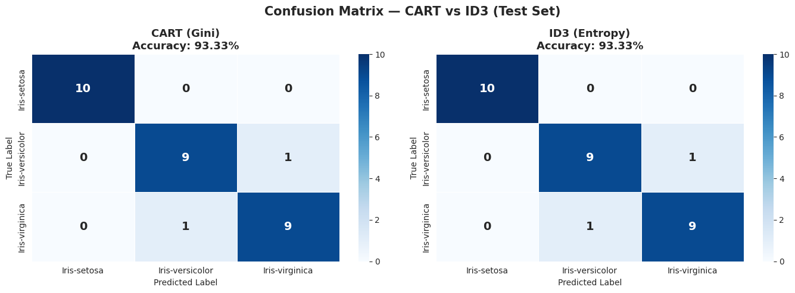

# Decision Tree Implementation — CART vs ID3
**Student ID:** 220143  
**Algorithm:** CART (Gini) vs ID3 (Entropy)  
**Dataset:** Iris Dataset  

---

## Project Description
This project implements and compares two Decision Tree algorithms — CART using Gini criterion and ID3 using Entropy criterion. Both models are tuned using Cross-Validation with GridSearchCV to find the best max_depth and min_samples_split parameters.

---

## Repository Structure
---

## Visualizations

### Confusion Matrix — CART vs ID3

### Decision Boundary — CART vs ID3

### ROC Curve — CART vs ID3

### Evaluation Metrics — CART vs ID3

### Decision Tree Structure

---

## Model Comparison

| Metric | CART (Gini) | ID3 (Entropy) |
|--------|------------|---------------|
| Accuracy | 0.9333 | 0.9333 |
| Precision | 0.9333 | 0.9333 |
| Recall | 0.9333 | 0.9333 |
| F1 Score | 0.9333 | 0.9333 |
| AUC | 0.9733 | 0.9500 |

---

## 🔗 Links
- **Colab Notebook:** https://colab.research.google.com/drive/15JyVCwIalZNsjs83LjY7KayMoOs75Ftn?usp=sharing
- **GitHub Repo:** https://github.com/rubyat43/220143_DT_Decision_Tree
